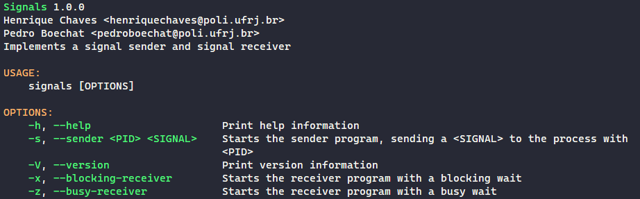

# Trabalho 1

## Tech Stack

- [Rust 1.60.0](https://blog.rust-lang.org/2022/04/07/Rust-1.60.0.html)

- [Debian](https://www.debian.org/)

## Como executar os programas?

1. Entre na pasta de um programa
2. Compile o programa com o comando `cargo build --release`
3. O executável estará localizado em `./target/release/<EXECUTÁVEL>`

## Ajuda da linha de comando

### 2) [Sinais](https://github.com/pedroboechat/COS470_SistemasDistribuidos/tree/main/Trabalho_1/02_Signals) (executável: `signals`)

### 3) [Pipes](https://github.com/pedroboechat/COS470_SistemasDistribuidos/tree/main/Trabalho_1/03_Pipes) (executável: `pipes`)

### 4) [Sockets](https://github.com/pedroboechat/COS470_SistemasDistribuidos/tree/main/Trabalho_1/04_Sockets) (executável: `sockets`)

